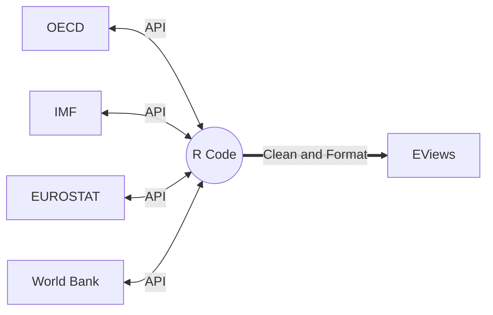

# WESP Data Pipeline

replace the outdated manual download with a more "modern" way to feed data into the WEFM, i.e.:

```mermaid
graph LR

R((R Code)) ==Clean and Format==> EViews
OECD & IMF & EUROSTAT & WB[World Bank] <--API--> R
```

Project Structure

