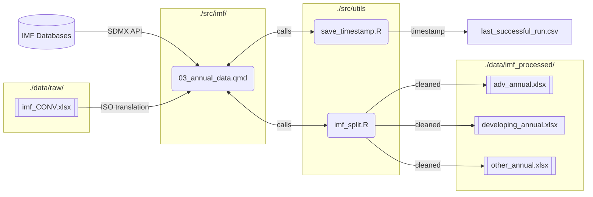

# WESP Data Pipeline

## Overview

- replace the outdated manual download with a more "modern" way to feed data into the **World Economic Forecasting Model** (WEFM) 
- uses the [SDMX](https://www.sdmx.io/) API Schema to access a range of economic databases from different organisations ([IMF](https://data.imf.org/en), [OECD](https://data-explorer.oecd.org/), [OECD](https://ec.europa.eu/eurostat/data/database))
- coded in R (mostly [Quarto](https://quarto.org/) Markdown Files), with a lot of comments in the files itself


## Workflow

The basic intution behind the pipeline is like this: take some Databases, clean them, take some additional files to format them to the WEFM expecations, and then output some excel files to be ingested into Eviews.

Here is an example for the IMF annual data:



1. access some IMF databases (e.g for Interest Rates or Balance of Payments) via the SDMX API
2. clean and transform it using the *tidyverse* packages
3. add the relevant country codes for WEFM from `imf_CONV.xlsx`
4. split it into the country groupings using the utility script `imf_split.qmd`
5. save the excel files into the `data/imf_processed` folder
6. update the timestamp for last accessed in the `last_successful_run.csv` 


## Usage

1. To get started with the project, you have to use `renv`, which is used to keep the package versions synced and up to date.
```
install.packages("renv") # install renv if you don't have it yet renv::restore() # restore the environment
```

2. After that, run the respective quarto files in the folder `src/` 
   (e.g `src/imf/03_annual_data.qmd` for annual IMF data). Each of these files is independent and can be run separately.
   - Either open the files in RStudio and run them from there (easier)
     - Make sure to use the option in the top right **Run -> Restart R and run all Chunks** to have a clean slate in each run
   - Alternatively, run the whole file via the command line:
   ```
   quarto render src/imf/03_annual_data.qmd
   ```
   - *In the long run, this could be automated using a Makefile or similar, but for now, this is sufficient.*

3. Check in the `last_successful_run.csv` file to see when the last run was for each data source.

*Feel free to go into each Quarto Code file and look at it before running it, there are a some more comments in there too to explain how it works*

## Project Structure

Hres a file tree with a little explanation 

```
├── data                    # data 
│   ├── eurostat_processed  # processed eurostat data
│   ├── imf_processed        
│   ├── oecd_processed
│   └── raw                 # raw data files used as inputs
├── docs
├── examples                # examples from the old WEFM
│   ├── eurostat
│   ├── imf
│   └── oecd
├── renv                    # renv environment files
└── src                     # source code
    ├── eurostat
    ├── imf
    ├── oecd
    └── utils               # utility functions
├── README.md               # this file  
└── renv.lock               # renv lock file
```


## Data Sources

**IMF**

Monthly Data:

| IMF-Dataset | IMF Code          | WEFM Code   | WEFM Description                                             |
| ----------- | ----------------- | ----------- | ------------------------------------------------------------ |
| ER          | XDC_USD; PA_RT    | *_rfx_ncdol | Exchange rates, domestic currency per usd, period average, rate |
| MFS_IR      | MFS166_RT_PT_A_PT | *_rird      | Financial, Interest Rates, Monetary Policy-Related Interest Rate, Percent per annum |

Annual Data

| IMF Dataset | IMF Code               | WEFM Code        | WEFM Description                                             |
| ----------- | ---------------------- | ---------------- | ------------------------------------------------------------ |
| ER          | XDC_USD, PA_RT         | *_rft_ncdol      | Exchange rates, domestic currency per usd, period average, rate |
| CPI         | CPI; _T; IX            | *PCPI            | Prices, Consumer Price Index, All items, Index               |
| CPI         | CPI; _T;YOY_PCH_PA_PT; | *PCP_GR          | Prices, Consumer Price Index, All items, Percentage change, Corresponding period previous year, Percent |
| WEO         | BCA                    | *BCANET$         | Supplementary Items, Current Account, Net (Excluding Exceptional Financing), US Dollars |
| MFS_MA      | BM_MAI                 | *mnm2            | Monetary, M2, Domestic Currency                              |
| QGFS        | G24_T_XDC; S13         | *gg_gei_g01_xdc  | Fiscal, General Government, Expense, Interest, 2001 Manual, Domestic Currency |
| QGFS        | G24_T_XDC; S1311B      | *bcg_gei_g01_xdc | Fiscal, Budgetary Central Government, Expense, Interest, 2001 Manual, Domestic Currency |


## TODO

- [x] Log Tracker Script
- [x] Regions Utils Script
- [ ] Runner Script
- [x] Key Creation Transparency
- [x] Workflow explanation
- [x] Slides for the Workshop
