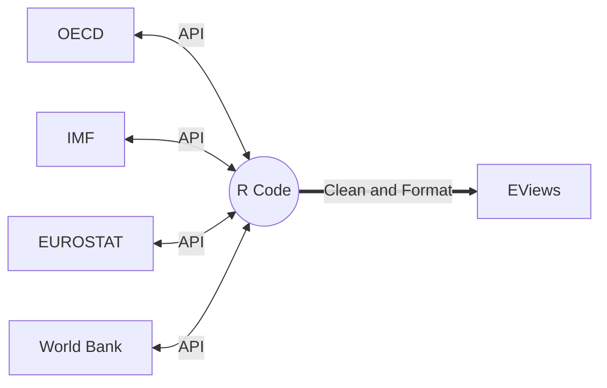

# WESP Data Pipeline

## Overview

replace the outdated manual download with a more "modern" way to feed data into the WEFM, i.e.:

## Usage

## Data Sources

## Workflow

## TODO

- Log Tracker Script
- Regions Utils Script
- Runner Script
- Key Creation Transparency
