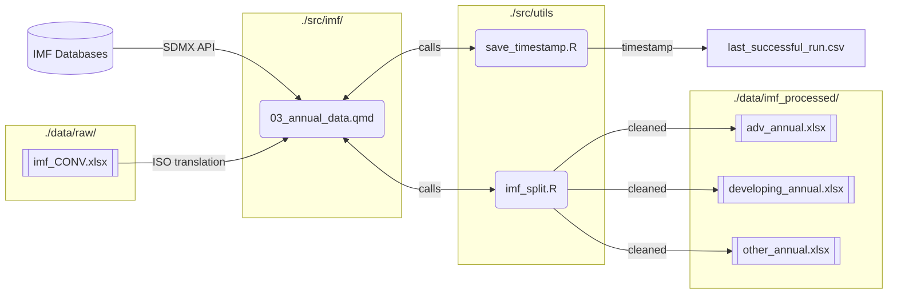

# WESP Data Pipeline

- replace the outdated manual download with a more "modern" way to feed data into the **World Economic Forecasting Model** (WEFM) 
- uses the [SDMX](https://www.sdmx.io/) API Schema to access a range of economic databases from different organisations ([IMF](https://data.imf.org/en), [World Bank](https://data.worldbank.org/) , [OECD](https://ec.europa.eu/eurostat/data/database))
- coded in R (mostly [Quarto](https://quarto.org/) Markdown Files), with a lot of comments in the files itself to explain whats happening


**Table of Contents:**

* [Workflow](#workflow)
* [Step-by-Step Instructions](#step-by-step-instructions)
* [Project Structure](#project-structure)
* [Data Sources](#data-sources)
  + [IMF](#imf)
  + [Eurostat](#eurostat)
  + [World Bank](#world-bank)


## Workflow

The basic intuition behind the pipeline is as follows: take some databases, clean them, and take some additional files to format them to the WEFM expecations. Then, output Excel files to be ingested into EViews.


Here is an example for IMF annual data:


```mermaid
graph LR

subgraph ./src/imf/
R(03_annual_data.qmd)
end

subgraph ./data/imf_processed/
1 & 2 & 3
end

subgraph ./data/raw/
B[[imf_CONV.xlsx]]
end

subgraph ./src/utils
a(save_timestamp.R)
b(imf_split.R)
end

I[(IMF Databases)] --SDMX API--> R  
B --ISO translation--> R
R <--calls--> b --cleaned--> 1[[adv_annual.xlsx]] & 2[[developing_annual.xlsx]] & 3[[other_annual.xlsx]] 
R <--calls--> a --timestamp--> 4[last_successful_run.csv]

```

1. access some IMF databases (e.g for Interest Rates or Balance of Payments) via the SDMX API
2. clean and transform the data using the *tidyverse* packages
3. add the relevant country codes for WEFM from `imf_CONV.xlsx`
4. split it into the country groupings using the utility script `imf_split.qmd`
5. save the excel files into the `data/imf_processed` folder
6. update the timestamp in `last_successful_run.csv` 

Note: The final output data files are overwritten with each run. That's why there is a timestamp file, so you can see when they were last edited. If you open and edit the files in Excel, be sure to copy them to a different location; otherwise, your edits will be lost. 

## Step-by-Step Instructions

1. Go to the GitHub Code Repository (https://github.com/skriptum/WESP-Pipeline) and click on "Code > Download ZIP" to download the complete code
2. Unzip the Folder, move it to an appropriate location and open the `WESP_Pipeline.Rproj` file in RStudio
3. To recreate the environment, I used [renv](https://rstudio.github.io/renv/articles/renv.html) to keep track of the packages used. You need to restore the packages on my computer to make the project run on yours.

   - ```
          install.packages("renv") # install renv if you don't have it yet 
          renv::restore() # restore the environment
      ```
   - This could take some time, as downloading and extracting all packages takes some time
   - If it doesnt work, you need to go into each code file and download the packages that are required

4. Now, youre ready to run the code. The easiest way is to run the "Master" File `run-pipeline.qmd`. This file runs the process for all sources (IMF, WB, EUROSTAT), downloading and processing the data and places the finished files in the `./data/` folder

5. Now, you should check that everything smoothly. Go into `last-successful-run.csv` and take a look at the table. 

   - You should see the name of respective files, as well as their last update time and a "Success" in the status column
   - If that is not the case, go into the respective individual files to run them independently and see where they are failing


*Feel free to go into each Quarto Code file and look at it before running it, there are a some more comments in there too to explain how it works*

## Project Structure

Hres a file tree with a little explanation 

```
├── data                    # data 
│   ├── eurostat_processed  # processed data sets (here eurostat)
│   ├── imf_processed        
│   ├── wb_processed
│   └── raw                 # raw data files used as inputs
├── docs
├── examples                # examples from the old WEFM
│   ├── eurostat
│   ├── imf
│   └── wb
├── renv                    # renv environment files
└── src                     # source code
    ├── eurostat
    ├── imf
    ├── wb
    └── utils               # utility functions
├── last_successful_run.csv # timestamp for last successful run of the pipeline
├── README.md               # this file 
├── run-pipeline.qmd        # code file to run the whole pipeline at once
└── renv.lock               # renv lock file
```


## Data Sources

### IMF

Monthly Data:

| IMF-Dataset | IMF Code          | WEFM Code                       | WEFM Description                                             |
| ----------- | ----------------- | ------------------------------- | ------------------------------------------------------------ |
| ER          | XDC_USD; PA_RT    | ENDA_XDC_USD_RATE / *_rfx_ncdol | Exchange rates, domestic currency per usd, period average, rate |
| MFS_IR      | MFS166_RT_PT_A_PT | FPOLM_PA / *_rird               | Financial, Interest Rates, Monetary Policy-Related Interest Rate, Percent per annum |

Annual Data

| IMF Dataset | IMF Code               | WEFM Code                            | WEFM Description                                             |
| ----------- | ---------------------- | ------------------------------------ | ------------------------------------------------------------ |
| ER          | XDC_USD, PA_RT         | ENDA_XDC_USD_RATE /*_rft_ncdol       | Exchange rates, domestic currency per usd, period average, rate |
| CPI         | CPI; _T; IX            | PCPI_IX / *PCPI                      | Prices, Consumer Price Index, All items, Index               |
| CPI         | CPI; _T;YOY_PCH_PA_PT; | PCPI_PC_CP_A_PT / *PCPI_GR           | Prices, Consumer Price Index, All items, Percentage change, Corresponding period previous year, Percent |
| WEO         | BCA                    | BCAXF_BP6_USD / *BCANET$             | Supplementary Items, Current Account, Net (Excluding Exceptional Financing), US Dollars |
| MFS_MA      | NDMBM_MAI              | FMB_XDC / *mnm2                      | National Definitions of Money, Base Money                    |
| WEO         | GGXONLB - GGXCNL       | GG_GEI_G01_XDC                       | Fiscal, General Government, Expense, Interest, 2001 Manual, Domestic Currency |
| QGFS        | G24_T_XDC; S13         | GG_GEI_G01_XDC_OLD / *gg_gei_g01_xdc | Fiscal, General Government, Expense, Interest, 2001 Manual, Domestic Currency (OLD) |
| QGFS        | G24_T_XDC; S1311B      | BCG_GEI_G01_XDC / *bcg_gei_g01_xdc   | Fiscal, Budgetary Central Government, Expense, Interest, 2001 Manual, Domestic Currency |

There are 2 different Indicators for General Government Interest Expense

- From the Quarterly Government Financial Statistics. This is the "official" IMF one, which is only available for ca 60 countries and a limited range of years
- one calculated from the WEO. It uses Government Balance data to calculate Interest Expense and lines up with the values from WB WDI, but with a larger coverage of countries
- both are still in the dataset, in case there is a decision to use the QGFS instead of WEO where available

The data sources used in the Calculation (from [WEO](https://data.imf.org/en/datasets/IMF.RES:WEO)):

- GGXONLB: Primary net lending (+) / net borrowing (-), General government, Domestic Currency
- GGXCNL: Net lending (+) / net borrowing (-), General government, Domestic Currency

### Eurostat

The Links in the table already have the required preselection!

| Indicators               | Unit                                                         | Adjustment                                | Eurostat Dataset ID                                          | Code                          |
| ------------------------ | ------------------------------------------------------------ | ----------------------------------------- | ------------------------------------------------------------ | ----------------------------- |
| Annual GDP components    | Chain Linked Volums (2010); Current Prices (millions of nat. curr) | None                                      | [NAMA_10_GDP](https://ec.europa.eu/eurostat/databrowser/view/NAMA_10_GDP__custom_15679333/default/table?lang=en) | {ISO}\_{CODE}\_{ADJ}\_ESTAT_Q |
| Quarterly GDP Components | Chain Linked Volums (2010); Current Prices (millions of nat. curr) | unadjusted; Seasonal; Seasonal + Calendar | [NAMQ_10_GDP](https://ec.europa.eu/eurostat/databrowser/view/namq_10_gdp__custom_20133126/default/table) | {ISO}\_{CODE}\_{ADJ}\_ESTAT_Q |
| Annual Unemployment      | % of pop in labour force (age 15-74)                         | None                                      | [UNE_RT_A](https://ec.europa.eu/eurostat/databrowser/view/une_rt_a__custom_15679523/default/table?lang=en) | {ISO}_URX_ESTAT               |
| Monthly Unemployment     | % of pop in labour force (total pop)                         | Seasonal                                  | [UNE_RT_M](https://ec.europa.eu/eurostat/databrowser/view/une_rt_m__custom_20133163/default/table) | {ISO}_URX_ESTAT_M             |
| Annual HICP              | All-items HICP, Annual Average                               | None                                      | [PRC_HICP_AIND](https://ec.europa.eu/eurostat/databrowser/view/prc_hicp_aind__custom_15679491/default/table?lang=en) | {ISO}_HIC_ESTAT               |
| Monthly HICP             | All-items HICP, 2015=100                                     | None                                      | [PRC_HICP_MIDX](https://ec.europa.eu/eurostat/databrowser/view/prc_hicp_midx__custom_15679516/default/table?lang=en) | {ISO}_HIC_ESTAT_M             |

Annual GDP components are (Chain Linked Value code / Current Prices code)

- Gross domestic product at market prices (YER / YCN)
- Final consumption expenditure of general government (GCR / GCN)
- Household and NPISH final consumption expenditure (PCR / PCN)
- Gross fixed capital formation (ITR / ITN)
- Exports of goods and services (XTR / XTN)
- Imports of goods and services (MTR / MTN)


### World Bank

Indicators taken from the World Bank [WDIs](https://data.worldbank.org/indicator?tab=all)

| Description                                                  | WEFM Code | WDI Code          |
| ------------------------------------------------------------ | --------- | ----------------- |
| Interest payments (current LCU)                              | GGEI      | GC.XPN.INTP.CN    |
| GNI per capita, Atlas method (current US$)                   | GNICAP    | NY.GNP.PCAP.CD    |
| Gini index                                                   | GINI      | SI.POV.GINI       |
| Survey mean consumption or income per capita, total population (2021 PPP $ per day) | YBAR      | SI.SPR.PCAP       |
| Poverty headcount ratio at $3.00 a day (2021 PPP) (% of population) | HEAD      | SI.POV.DDAY       |
| PPP conversion factor, GDP (LCU per international $)         | /         | PA.NUS.PPP        |
| GDP, PPP (current international $)                           | /         | NY.GDP.MKTP.PP.CD |
| GDP, PPP (constant 2021 international $)                     | /         | NY.GDP.MKTP.PP.KD |

